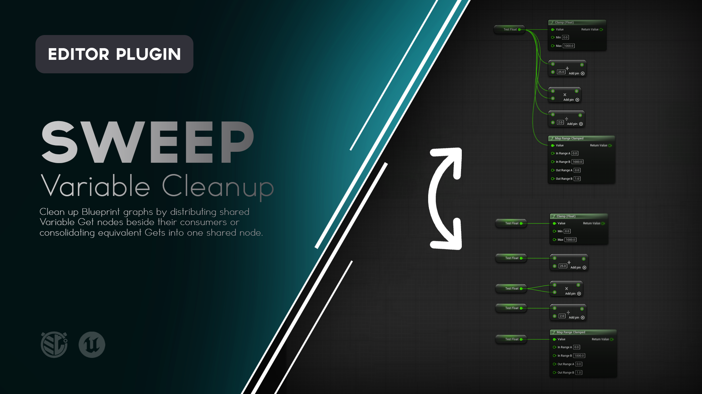
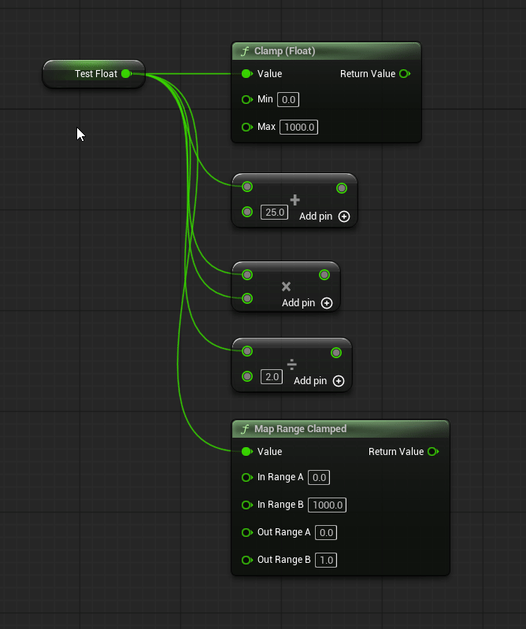
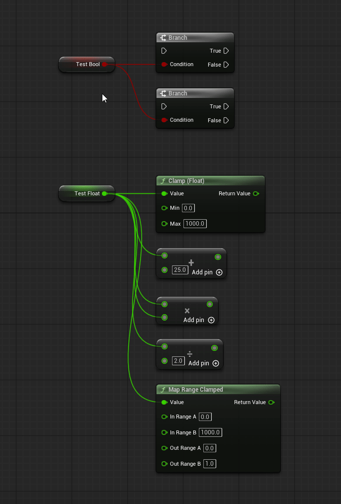
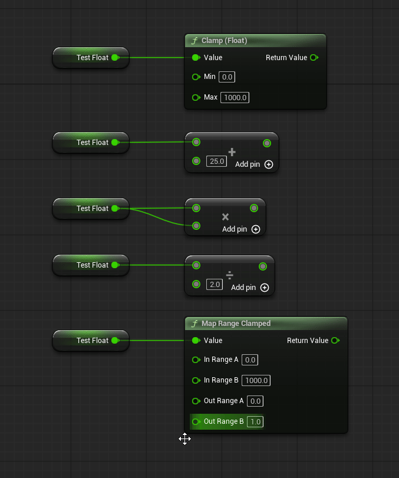

# Sweep

**Clean up long Blueprint variable wires without changing what the graph does.**

Sweep adds two focused refactoring tools to Unreal Engine Blueprint graphs: distribute one heavily reused Variable Get into local Gets beside its consumers, or consolidate several equivalent Gets back into one shared node.




---

## What is Sweep?

Blueprint graphs often accumulate long wires from a single Variable Get to inputs spread across a large graph.

The logic may be perfectly valid, but the graph becomes harder to read because one small node owns several long connections that cross unrelated parts of the Blueprint.

Sweep lets you reorganize those reads without manually recreating nodes and rewiring every connection.

With Sweep you can:

- **Distribute** a shared Variable Get into local Gets beside the nodes that consume it.
- **Consolidate** several equivalent Variable Gets into one chosen shared Get.
- Follow Blueprint reroute chains when distributing.
- Clean up reroutes that become genuinely unused.
- Work with several selected Variable Gets in one operation.
- Undo or Redo the complete refactor as one editor transaction.

Sweep is intentionally focused on **pure Variable Get nodes** for version 1.0.0. It does not attempt to rewrite arbitrary Blueprint expressions or execution logic.

---

# Features

### Distribute Variable Gets

Turn one shared Variable Get with several consumers into local Gets positioned beside those consumers.

```text
Before

Get Health
    +-------------> Consumer A
    +--------------------------> Consumer B
    +-------> Consumer C

After

Get Health -> Consumer A

Get Health -> Consumer B

Get Health -> Consumer C
```

### Consolidate Variable Gets

Select equivalent Variable Gets and merge them into the Get you right-click.

```text
Before

Get Health -> Consumer A
Get Health -> Consumer B
Get Health -> Consumer C

After

Get Health
    +-------------> Consumer A
    +--------------------------> Consumer B
    +-------> Consumer C
```

### Reroute-Aware Distribution

Sweep follows Blueprint reroute chains to the real consuming inputs.

If a reroute becomes genuinely unused after the refactor, Sweep removes it. Shared or still-active reroutes remain untouched.

### Reroute-Preserving Consolidation

Consolidation keeps the existing wire topology.

If the selected Gets feed reroute chains, those reroutes stay in place and are reconnected to the surviving Get.

### Multi-Selection

Select several eligible Variable Gets and distribute them together in one operation.

Sweep preserves the selection that existed immediately before Unreal opens the node context menu, allowing batch operations even though Unreal may visually collapse the selection when a node is right-clicked.

### Context-Safe Consolidation

Sweep does not compare nodes by visible name alone.

Selected Gets must reference the same underlying variable and have equivalent input context before consolidation becomes available.

### Destination-Based Placement

Distributed Gets are placed to the left of their consuming nodes and approximately aligned with the inputs they feed.

Sweep checks nearby graph nodes and tries alternate vertical positions to reduce obvious overlap without moving existing nodes.

### One Get per Destination Node

If the same source Get feeds several inputs on one destination node, Sweep creates one replacement Get for that destination rather than one Get per wire.

### Undo / Redo

A Sweep operation is recorded as one Unreal Editor transaction.

One Undo restores the original graph arrangement. Redo reapplies the refactor.

### Editor Only

Sweep is an editor utility.

It adds no runtime systems, gameplay components, or packaged-game dependencies.

---



---

# Using Sweep

Sweep is available from the Blueprint graph node context menu.

## Distribute a Variable Get

1. Find a pure Variable Get that feeds at least two terminal consumer inputs.
2. Right-click the Variable Get.
3. Choose:

```text
Sweep
    Distribute Variable Get
```

Sweep creates local copies of the Get near the destination nodes, reconnects the consumers, and removes the original Get when nothing still depends on it.

The command tooltip explains the operation before it is run:

> Replace this shared Variable Get with local copies beside each consuming node. Sweep preserves the variable reference and input context, follows reroute chains, and removes only reroutes left unused.

---

## Distribute Several Selected Gets

Select several eligible Variable Gets, then right-click one of those selected Gets.

The command becomes:

```text
Sweep
    Distribute Selected Variable Gets
```

Every eligible selected Get is processed in one Undo transaction.

Other selected node types are ignored.

If you right-click a supported Variable Get that was **not** part of the previous selection, Sweep treats that node as a single-node operation instead of modifying the other selected Gets.



---

## Consolidate Variable Gets

Select two or more equivalent Variable Get nodes.

Right-click the Get you want to keep, then choose:

```text
Sweep
    Consolidate Selected Variable Gets
```

The Get you right-click becomes the survivor.

Sweep:

1. Keeps that Get in its existing location.
2. Transfers the outgoing connections from the other selected equivalent Gets.
3. Preserves direct and rerouted wire paths.
4. Deletes redundant Gets after their connections are transferred.

The command tooltip states the survivor rule directly:

> Merge the selected equivalent Variable Gets into the Get you right-clicked. The right-clicked Get stays in place, direct and rerouted wire paths are preserved, and one Undo restores the original nodes.



---

# What Counts as an Equivalent Variable Get?

Consolidation is intentionally conservative.

Two nodes are not considered equivalent merely because they display the same variable name.

Sweep checks that the selected Gets:

- are supported pure Variable Get nodes,
- belong to the same Blueprint graph,
- reference the same underlying variable,
- have equivalent self/context information,
- have equivalent input-pin defaults and linked context pins.

For example, these should not be merged if they read from different object targets:

```text
Target A -> Get Health
Target B -> Get Health
```

This protects the graph from a visual cleanup operation changing which object actually supplies a value.

---

# Reroute Behavior

## During Distribution

Sweep treats reroutes as presentation nodes and follows them to the actual consuming inputs.

Example:

```text
Get Health -> Reroute -> Reroute -> Consumer A
                           |
                           +-----------> Consumer B
```

Sweep distributes Gets beside the real consumers.

After rewiring, it repeatedly removes only reachable reroutes whose outputs are genuinely unused.

A reroute that still feeds another live connection remains in the graph.

## During Consolidation

Sweep does **not** clean up reroutes when consolidating.

The purpose of Consolidate is to combine the source Gets while preserving the existing outgoing topology.

```text
Get Health -> Reroute -> Consumer A
Get Health -> Reroute -> Consumer B
```

can become:

```text
             +-> Reroute -> Consumer A
Get Health --+
             +-> Reroute -> Consumer B
```

---

# Placement

Distributed Gets are positioned using the destination node as the primary reference.

Sweep attempts to:

- place the Get to the left of the destination,
- align it approximately with the destination inputs it feeds,
- keep one Get per destination node,
- avoid obvious overlap with nearby graph nodes,
- leave all existing graph nodes exactly where they are.

Comment boxes are treated as containers rather than collision obstacles, allowing generated Gets to remain within an existing visual grouping.

Sweep is not a full Blueprint auto-layout system and does not attempt to reorganize the rest of the graph.

---

# Example Workflow

Imagine one `Get CurrentHealth` node near the start of a large Blueprint graph.

It feeds five calculations spread across the graph, producing long crossing wires.

You can:

1. Right-click `Get CurrentHealth`.
2. Choose **Sweep > Distribute Variable Get**.
3. Sweep creates one local Get near each destination node.
4. Continue editing the graph with the value source visible beside each use.

Later, if you decide the local Gets are too repetitive:

1. Select the equivalent `Get CurrentHealth` nodes.
2. Right-click the one you want to keep.
3. Choose **Sweep > Consolidate Selected Variable Gets**.
4. Sweep reconnects the selected consumers to that surviving Get.

The two operations let you move between local readability and shared-source wiring without manually rebuilding the graph.

---

# Installation

Sweep can be installed through **Fab**, from a **precompiled GitHub Release**, or directly from the **GitHub source**.

For most users, the Fab or GitHub Release installation is recommended.

---

## Fab / Epic Games Launcher

> **Availability:** Use this installation method once Sweep is available through Fab.

1. Add **Sweep** to your library on Fab.
2. Open the **Epic Games Launcher**.
3. Navigate to your Unreal Engine Library.
4. Locate Sweep in your Fab / Vault library.
5. Install Sweep to a supported Unreal Engine version.
6. Launch your Unreal Engine project.
7. Open **Edit > Plugins**.
8. Search for **Sweep**.
9. Enable the plugin if it is not already enabled.
10. Restart Unreal Editor if prompted.

Once enabled, Sweep commands are available when right-clicking supported Variable Get nodes in Blueprint graphs.

---

## GitHub Release

This is the easiest GitHub installation method because the release package is already prepared for a supported Unreal Engine version and platform.

### 1. Download Sweep

Open the repository's **Releases** page:

https://github.com/mippi-the-dork/Sweep/releases

Download the latest release package matching your Unreal Engine version and platform.

For example:

```text
Sweep-v1.0.0-UE5.8.3-Win64.zip
```

### 2. Close Unreal Editor

Close the project before installing the plugin.

### 3. Locate Your Project Plugins Folder

Your project should contain a `Plugins` directory beside the `.uproject` file:

```text
YourProject/
|-- Config/
|-- Content/
|-- Plugins/
`-- YourProject.uproject
```

If the `Plugins` directory does not exist, create it.

### 4. Extract Sweep

Extract the `Sweep` folder into:

```text
YourProject/Plugins/
```

The final structure should look similar to:

```text
YourProject/
|-- Plugins/
|   `-- Sweep/
|       |-- Config/
|       |-- Doc/
|       |-- Source/
|       `-- Sweep.uplugin
`-- YourProject.uproject
```

### 5. Launch the Project

Open your Unreal Engine project.

If necessary, navigate to:

**Edit > Plugins**

Search for:

```text
Sweep
```

Enable the plugin and restart Unreal Editor if prompted.

---

## GitHub Source

Developers who want the source or want to modify Sweep can clone the repository directly.

### Requirements

Building Sweep from source requires a working Unreal Engine C++ development environment.

For Windows this generally means:

- Unreal Engine 5.8.0 - 5.8.3
- Visual Studio with the appropriate C++ workloads
- A project capable of compiling C++ plugins

### Clone the Repository

Close Unreal Editor and navigate to your project's `Plugins` directory.

```bash
cd YourProject/Plugins
git clone https://github.com/mippi-the-dork/Sweep.git
```

Your project should now contain:

```text
YourProject/Plugins/Sweep/
```

### Generate Project Files

If necessary:

1. Right-click your `.uproject`.
2. Select **Generate Visual Studio project files**.

Then open the generated solution and build your project's Editor target.

For example:

```text
YourProjectEditor
Win64
Development Editor
```

Launch the project after compilation completes.

---

# Updating Sweep

## GitHub Release Installation

When updating a manually installed release:

1. Close Unreal Editor.
2. Remove the existing `Plugins/Sweep` folder.
3. Extract the new Sweep release into the `Plugins` directory.
4. Reopen the project.

Replacing the complete plugin folder is recommended rather than copying individual files over an older version.

## Git Source Installation

If you cloned the repository using Git:

```bash
cd YourProject/Plugins/Sweep
git pull
```

Rebuild the project if the source has changed.

---

# Compatibility

The current Sweep release targets:

| | |
|---|---|
| **Sweep Version** | 1.0.0 |
| **Unreal Engine** | 5.8.0 - 5.8.3 |
| **Primary Development Version** | 5.8.3 |
| **Platform** | Windows 64-bit |
| **Plugin Type** | Editor |
| **Runtime Dependency** | None |
| **Packaged Game Impact** | None |

Sweep is currently configured as a **Win64 editor plugin**.

The source plugin intentionally does not declare an exact `EngineVersion` in its descriptor. This avoids treating the source plugin as tied to one exact Unreal build while the project itself provides the engine it compiles against.

Compatibility with engine versions or platforms outside the range listed above should not be assumed unless explicitly stated in a release.

---

# How Sweep Works

Sweep operates on Blueprint graph data through Unreal's normal K2 graph and transaction systems.

## Distribution

When a supported Variable Get is distributed:

1. Sweep traces its value output through any connected reroute chains.
2. It identifies the real terminal input pins consuming the value.
3. Consumers are grouped by destination node.
4. Sweep creates a matching Variable Get for each destination node through Unreal's normal K2 node-spawn path.
5. The original variable reference and input context are copied to each new Get.
6. Destination inputs are reconnected through the Blueprint schema.
7. Reroutes that become genuinely unused are removed.
8. The original Get is removed only when no connection still depends on it.

## Consolidation

When equivalent selected Gets are consolidated:

1. The right-clicked Get becomes the anchor.
2. Sweep validates that the selected Gets reference the same variable and equivalent input context.
3. Existing outgoing connections are transferred to the anchor through the Blueprint schema.
4. Reroutes remain in their existing topology.
5. A redundant Get is deleted only after its links transfer successfully.
6. If Unreal rejects an unexpected connection, that source Get's original wires are restored rather than leaving it partially consolidated.

Both operations mark the Blueprint modified and participate in normal Undo and Redo.

---

# What Sweep Does Not Do

Sweep is a **focused Blueprint graph cleanup utility**, not a general-purpose graph optimizer.

Version 1.0.0 does not:

- modify Blueprint execution flow,
- distribute nodes with execution pins,
- rewrite arbitrary pure function nodes,
- refactor every input or output pin type,
- automatically reorganize the whole graph,
- move existing nodes to make room,
- change variable definitions,
- change runtime gameplay behavior intentionally,
- replace Blueprint compilation or validation.

Sweep's first release deliberately limits its transformations to supported pure Variable Get nodes where equivalence can be checked conservatively.

---

# Limitations

### Variable Gets Only

Version 1.0.0 supports pure Blueprint Variable Get nodes.

Generalized pure-node and arbitrary pin refactoring are outside the v1 scope.

### Minimum Consumers for Distribution

A Variable Get must resolve to at least two terminal consuming inputs before the Distribute command is useful and becomes available.

### Destination-Based Placement

Sweep uses graph positions and estimated node dimensions rather than performing a full Slate layout pass.

Generated Gets should be placed sensibly near their consumers, but complex graph layouts may still benefit from small manual adjustments afterward.

### Equivalent Context Required for Consolidation

Selected Gets must reference the same actual variable and equivalent context.

Gets that look similar but read from different object targets are intentionally rejected.

### Other Graph Editors

Sweep targets Unreal Engine Blueprint K2 graphs. Other graph systems are outside the current scope.

---

# Troubleshooting

## Sweep Does Not Appear in the Context Menu

Check:

**Edit > Plugins**

Search for:

```text
Sweep
```

Confirm the plugin is enabled and restart Unreal Editor if it was just enabled.

Also confirm you are right-clicking a supported pure Variable Get inside a Blueprint K2 graph.

---

## Distribute Variable Get Does Not Appear

Distribution requires at least two terminal consumer inputs.

A Get with only one actual consumer does not need distribution, so Sweep does not offer that operation.

Reroute nodes do not count as terminal consumers. Sweep follows them to the actual destination inputs.

---

## Consolidate Selected Variable Gets Does Not Appear

Confirm that:

- at least two supported Variable Gets were selected before the right-click,
- the Get you right-clicked was part of that selection,
- all selected supported Gets reference the same underlying variable,
- the selected Gets have equivalent target/context inputs,
- the selected Gets belong to the same graph.

If the visible variable names match but the object context differs, Sweep intentionally refuses to consolidate them.

---

## Unreal Visually Deselects the Other Nodes When I Right-Click

Unreal may visually collapse a graph selection to the right-clicked node while opening the context menu.

Sweep preserves the immediately preceding Blueprint graph selection and uses that snapshot when the right-clicked Get belonged to it.

This allows the multi-selection commands to operate on the selection you made before opening the menu.

---

## A Reroute Was Removed During Distribution

Sweep removes only reroutes reachable from the distributed source whose output has become genuinely unused.

If a reroute still feeds another live consumer, it should remain.

Consolidation preserves reroute topology rather than cleaning it up.

---

## A Generated Get Is Not Exactly Aligned With an Input

Sweep estimates destination pin positions from graph data and checks nearby node bounds for obvious collisions.

It does not replace Unreal's graph layout system or move existing nodes. Small manual position adjustments can still be useful in unusually dense graphs.

---

# Reporting Bugs

If you encounter a problem, please open an issue:

https://github.com/mippi-the-dork/Sweep/issues

When reporting a bug, include:

- Sweep version
- Unreal Engine version
- Windows version
- whether Sweep was installed from Fab, a GitHub Release, or source
- whether the operation was Distribute or Consolidate
- whether multiple Gets were selected
- whether reroute nodes were involved
- the variable type involved
- the Blueprint graph type involved
- steps to reproduce the problem
- screenshots or video when relevant
- any relevant Unreal Editor log or compiler output

A screenshot of the graph before and after the operation is particularly useful for Sweep issues.

---

# Feature Requests

Suggestions and feature requests are welcome through GitHub Issues.

When proposing a feature, describe the Blueprint graph problem you are trying to solve rather than only the implementation you would like to see.

Sweep is intended to remain conservative about graph transformations, so new refactoring operations should have clear behavior-preservation rules.

---

# Contributions

Pull requests are welcome.

If you are considering a significant new graph transformation, opening an Issue first is recommended so its safety rules and intended scope can be discussed before substantial implementation work begins.

Sweep should remain a focused Blueprint cleanup utility rather than becoming an unrestricted automatic graph rewriter.

---

# License

Sweep is distributed under the license selected for this GitHub repository.

See the repository's `LICENSE` file for the current license terms.

---

# About

Sweep is an Unreal Engine editor utility created by **Mippi the Dork**.

The plugin was built around a simple Blueprint readability problem:

> A value used all over a graph should not require manually rebuilding the same variable reads just to make the graph easier to follow.

Sweep makes it quick to move between shared Variable Gets and local Variable Gets while keeping the underlying Blueprint behavior intact.
